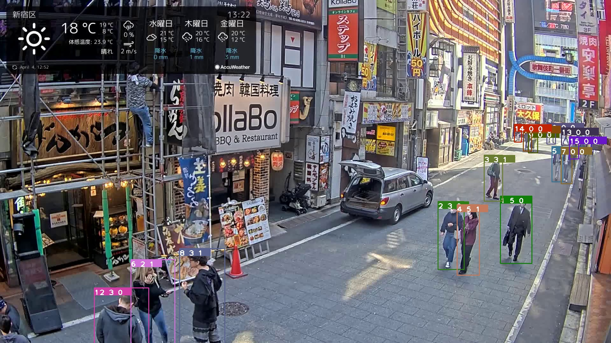

# haui_hackathon2023


## Installation

- platform: linux-64

Step 1: Install requirements file

```bash
pip install -r requirements.txt
```

Step 2: Clone 2 repo: ByteTrack and MiVOLO

```bash
git clone https://github.com/ifzhang/ByteTrack.git
git clone https://github.com/WildChlamydia/MiVOLO.git
```

Step 3: Install ByteTrack and MiVOLO

```
cd ByteTrack
python3 setup.py develop
-------------------------
cd MiVOLO
python3 setup.py develop
```

Step 4: Install Cython_bbox and Cython

```bash
pip install -e git+https://github.com/samson-wang/cython_bbox.git#egg=cython-bbox

pip install Cython
```

Step 5: Install Pycocotools

```bash
pip install cython
pip install 'git+https://github.com/cocodataset/cocoapi.git#subdirectory=PythonAPI'
```

## RUN

## DEMO

format: <track_id><age><gender>



## Citation


### ByteTrack
```bibtex
@article{zhang2022bytetrack,
  title={ByteTrack: Multi-Object Tracking by Associating Every Detection Box},
  author={Zhang, Yifu and Sun, Peize and Jiang, Yi and Yu, Dongdong and Weng, Fucheng and Yuan, Zehuan and Luo, Ping and Liu, Wenyu and Wang, Xinggang},
  booktitle={Proceedings of the European Conference on Computer Vision (ECCV)},
  year={2022}
}
```

### MiVOLO
```bibtex
@article{mivolo2023,
   Author = {Maksim Kuprashevich and Irina Tolstykh},
   Title = {MiVOLO: Multi-input Transformer for Age and Gender Estimation},
   Year = {2023},
   Eprint = {arXiv:2307.04616},
}
```